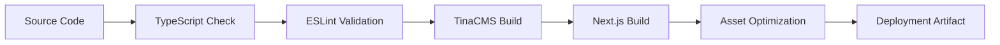

# Deployment & Development Workflow Documentation

## Overview

This document outlines the comprehensive deployment strategy and development workflows for the Narkins Builders web application, covering everything from local development to production deployment and monitoring.

## Development Environment Setup

### 1. Prerequisites

System Requirements:
- Node.js 18+ or Bun runtime
- Git version control
- MySQL database (optional for full features)
- Google Cloud Console access (for Sheets API)
- TinaCMS account and credentials

Development Tools:
```bash
# Essential tools
bun --version          # Bun runtime
node --version         # Node.js fallback
git --version          # Git version control
code --version         # VS Code (recommended)

# Optional tools
gh --version           # GitHub CLI
vercel --version       # Vercel CLI
```

### 2. Project Setup

Initial Setup:
```bash
# Clone repository
git clone https://github.com/your-organization/narkins-builders.git
cd narkins-builders

# Install dependencies
bun install

# Copy environment template
cp .env.example .env.local

# Verify setup
bun run blog:verify-setup
```

Environment Configuration:
```bash
# .env.local - Development environment
NODE_ENV=development
NEXT_PUBLIC_SITE_URL=http://localhost:3000
NEXT_TELEMETRY_DISABLED=1

# TinaCMS Configuration
NEXT_PUBLIC_TINA_CLIENT_ID=your_tina_client_id
TINA_TOKEN=your_tina_token
TINA_SEARCH_TOKEN=your_search_token

# Database Configuration (Optional)
DB_HOST=localhost
DB_USER=root
DB_PASSWORD=your_password
DB_NAME=narkinsbuilders_comments
DB_PORT=3306

# Google Sheets API
GOOGLE_SHEETS_CREDENTIALS={"type":"service_account",...}
GOOGLE_SHEET_ID=your_google_sheet_id

# Analytics
NEXT_PUBLIC_GA_ID=G-MEASUREMENT_ID

# Security
JWT_SECRET=your_jwt_secret_for_auth
```

### 3. Development Scripts

Available Commands:
```json
{
  "scripts": {
    "dev": "tinacms dev -c \"next dev --turbopack\"",
    "dev:next": "next dev --turbopack",
    "build": "tinacms build && next build",
    "build:fast": "next build",
    "build:full": "bunx tsc --noEmit && next lint && tinacms build && next build",
    "build:optimized": "./scripts/build-parallel.sh",
    "build:vercel": "./scripts/build-parallel.sh",
    "start": "next start",
    "typecheck": "bunx tsc --noEmit --incremental --tsBuildInfoFile .tsbuildinfo",
    "lint": "next lint",
    "check": "bunx tsc --noEmit && next lint",
    "tina:build": "tinacms build",
    "tina:dev": "tinacms dev"
  }
}
```

Development Workflow:
```bash
# Start development server with TinaCMS
bun run dev

# Start Next.js only (faster for UI development)
bun run dev:next

# Run type checking
bun run typecheck

# Run linting
bun run lint

# Run both type checking and linting
bun run check

# Build for production testing
bun run build
```

## Build Process

### 1. Build Pipeline Architecture

Build Sequence:


### 2. Parallel Build Script

Optimized Build Process:
```bash
#!/bin/bash
# scripts/build-parallel.sh
set -e

echo "🚀 Starting optimized build process..."

# Function to run commands in parallel
run_parallel() {
    local pids=()
    
    # Start background processes
    echo "📝 Running TypeScript check..."
    bunx tsc --noEmit --incremental --tsBuildInfoFile .tsbuildinfo &
    pids+=($!)
    
    echo "🔍 Running ESLint..."
    next lint &
    pids+=($!)
    
    # Wait for parallel processes
    for pid in "${pids[@]}"; do
        wait $pid || {
            echo "❌ Build process failed"
            exit 1
        }
    done
    
    echo "✅ Code quality checks passed"
}

# Function for sequential build steps
run_sequential() {
    echo "🏗️ Building TinaCMS..."
    tinacms build
    
    echo "🏗️ Building Next.js application..."
    next build
    
    echo "✅ Build completed successfully"
}

# Execute build pipeline
run_parallel
run_sequential

echo "🎉 Deployment ready!"
```

### 3. Build Optimization

Build Performance Features:
- SWC minification enabled
- Webpack optimizations for production
- Code splitting and bundle optimization
- Modern CSS and font loading optimizations

> For complete Next.js configuration details, see the actual `next.config.js` file in the project root

## CI/CD Pipeline

### 1. GitHub Actions Workflow

Main Workflow:
```yaml
# .github/workflows/main.yml
name: CI/CD Pipeline

on:
  push:
    branches: [ main, development ]
  pull_request:
    branches: [ main ]

env:
  NODE_VERSION: '18'
  BUN_VERSION: 'latest'

jobs:
  test:
    name: Test & Quality Checks
    runs-on: ubuntu-latest
    
    steps:
    - name: Checkout code
      uses: actions/checkout@v4
      
    - name: Setup Bun
      uses: oven-sh/setup-bun@v1
      with:
        bun-version: ${{ env.BUN_VERSION }}
        
    - name: Install dependencies
      run: bun install --frozen-lockfile
      
    - name: Type checking
      run: bun run typecheck
      
    - name: Lint code
      run: bun run lint
      
    - name: Run tests
      run: bun test
      
    - name: Build application
      run: bun run build:full
      env:
        NEXT_PUBLIC_TINA_CLIENT_ID: ${{ secrets.TINA_CLIENT_ID }}
        TINA_TOKEN: ${{ secrets.TINA_TOKEN }}

  security:
    name: Security Audit
    runs-on: ubuntu-latest
    
    steps:
    - name: Checkout code
      uses: actions/checkout@v4
      
    - name: Run security audit
      run: bun audit
      
    - name: Check for vulnerabilities
      run: bun audit --audit-level moderate

  deploy:
    name: Deploy to Vercel
    needs: [test, security]
    runs-on: ubuntu-latest
    if: github.ref == 'refs/heads/main'
    
    steps:
    - name: Checkout code
      uses: actions/checkout@v4
      
    - name: Deploy to Vercel
      uses: amondnet/vercel-action@v25
      with:
        vercel-token: ${{ secrets.VERCEL_TOKEN }}
        vercel-org-id: ${{ secrets.VERCEL_ORG_ID }}
        vercel-project-id: ${{ secrets.VERCEL_PROJECT_ID }}
        vercel-args: '--prod'
```

### 2. Pre-commit Hooks

Husky Configuration:
```json
{
  "husky": {
    "hooks": {
      "pre-commit": "lint-staged",
      "commit-msg": "commitlint -E HUSKY_GIT_PARAMS"
    }
  },
  "lint-staged": {
    "*.{ts,tsx}": [
      "bunx tsc --noEmit",
      "next lint --fix",
      "git add"
    ],
    "*.{json,css,md}": [
      "prettier --write",
      "git add"
    ]
  }
}
```

### 3. Code Quality Automation

ESLint Configuration:
```javascript
// .eslintrc.js
module.exports = {
  extends: [
    'next/core-web-vitals',
    '@typescript-eslint/recommended',
  ],
  rules: {
    // Custom rules for consistency
    '@typescript-eslint/no-unused-vars': 'error',
    '@typescript-eslint/no-explicit-any': 'warn',
    'react-hooks/exhaustive-deps': 'error',
    'no-console': process.env.NODE_ENV === 'production' ? 'error' : 'warn',
  },
  overrides: [
    {
      files: ['*.ts', '*.tsx'],
      parser: '@typescript-eslint/parser',
      parserOptions: {
        project: './tsconfig.json',
      },
    },
  ],
};
```

## Deployment Strategies

### 1. Vercel Deployment (Recommended)

Vercel Configuration:
```json
{
  "version": 2,
  "buildCommand": "bun run build:vercel",
  "devCommand": "bun run dev:next",
  "installCommand": "bun install",
  "framework": "nextjs",
  "env": {
    "NODE_ENV": "production",
    "NEXT_TELEMETRY_DISABLED": "1"
  },
  "build": {
    "env": {
      "NEXT_TELEMETRY_DISABLED": "1"
    }
  },
  "functions": {
    "src/pages/api/sitemap.xml.ts": {
      "maxDuration": 30
    },
    "src/pages/api/rss.xml.ts": {
      "maxDuration": 30
    },
    "src/pages/api/sheets.ts": {
      "maxDuration": 10
    }
  },
  "headers": [
    {
      "source": "/api/(.*)",
      "headers": [
        {
          "key": "Cache-Control",
          "value": "s-maxage=3600, stale-while-revalidate"
        }
      ]
    }
  ],
  "redirects": [
    {
      "source": "/admin",
      "destination": "/admin/index.html",
      "permanent": false
    }
  ]
}
```

Deployment Process:
```bash
# Manual deployment
vercel --prod

# Automatic deployment via Git
git push origin main  # Triggers automatic deployment
```

### 2. Alternative Deployment Options

Netlify Deployment:
```toml
# netlify.toml
[build]
  command = "bun run build"
  publish = ".next"

[build.environment]
  NODE_VERSION = "18"
  BUN_VERSION = "latest"

[[headers]]
  for = "/*"
  [headers.values]
    X-Frame-Options = "SAMEORIGIN"
    X-Content-Type-Options = "nosniff"
    Referrer-Policy = "strict-origin-when-cross-origin"

[[redirects]]
  from = "/admin"
  to = "/admin/index.html"
  status = 200
```

Docker Deployment:
```dockerfile
# Dockerfile
FROM oven/bun:latest AS base

# Install dependencies
FROM base AS deps
WORKDIR /app
COPY package.json bun.lockb ./
RUN bun install --frozen-lockfile

# Build application
FROM base AS builder
WORKDIR /app
COPY --from=deps /app/node_modules ./node_modules
COPY . .
RUN bun run build

# Production image
FROM base AS runner
WORKDIR /app

ENV NODE_ENV=production
ENV NEXT_TELEMETRY_DISABLED=1

RUN addgroup --system --gid 1001 nodejs
RUN adduser --system --uid 1001 nextjs

COPY --from=builder /app/public ./public
COPY --from=builder --chown=nextjs:nodejs /app/.next/standalone ./
COPY --from=builder --chown=nextjs:nodejs /app/.next/static ./.next/static

USER nextjs

EXPOSE 3000

ENV PORT=3000
ENV HOSTNAME="0.0.0.0"

CMD ["bun", "server.js"]
```

## Environment Management

### 1. Environment Variables

Production Environment:
```bash
# Production .env
NODE_ENV=production
NEXT_PUBLIC_SITE_URL=https://www.narkinsbuilders.com
NEXT_TELEMETRY_DISABLED=1

# TinaCMS Production
NEXT_PUBLIC_TINA_CLIENT_ID=prod_client_id
TINA_TOKEN=prod_token
TINA_SEARCH_TOKEN=prod_search_token

# Database Production
DB_HOST=production-db-host
DB_USER=production_user
DB_PASSWORD=secure_production_password
DB_NAME=narkinsbuilders_prod
DB_PORT=3306

# APIs Production
GOOGLE_SHEETS_CREDENTIALS=production_service_account_json
GOOGLE_SHEET_ID=production_sheet_id

# Analytics Production
NEXT_PUBLIC_GA_ID=G-PRODUCTION_ID

# Security Production
JWT_SECRET=secure_production_jwt_secret
ENCRYPTION_KEY=secure_production_encryption_key
```

Staging Environment:
```bash
# Staging .env
NODE_ENV=staging
NEXT_PUBLIC_SITE_URL=https://staging-narkinsbuilders.vercel.app
NEXT_TELEMETRY_DISABLED=1

# TinaCMS Staging
NEXT_PUBLIC_TINA_CLIENT_ID=staging_client_id
TINA_TOKEN=staging_token

# Database Staging
DB_HOST=staging-db-host
DB_USER=staging_user
DB_PASSWORD=staging_password
DB_NAME=narkinsbuilders_staging

# Test API Keys
GOOGLE_SHEETS_CREDENTIALS=staging_service_account_json
GOOGLE_SHEET_ID=staging_sheet_id
NEXT_PUBLIC_GA_ID=G-STAGING_ID
```

### 2. Secret Management

Vercel Secrets:
```bash
# Add secrets to Vercel
vercel env add TINA_TOKEN production
vercel env add DB_PASSWORD production
vercel env add GOOGLE_SHEETS_CREDENTIALS production
vercel env add JWT_SECRET production

# List environment variables
vercel env ls

# Pull environment variables for local development
vercel env pull .env.local
```

GitHub Secrets:
```bash
# Required GitHub Actions secrets
VERCEL_TOKEN=your_vercel_token
VERCEL_ORG_ID=your_org_id
VERCEL_PROJECT_ID=your_project_id
TINA_CLIENT_ID=your_tina_client_id
TINA_TOKEN=your_tina_token
```

## Monitoring & Analytics

### 1. Application Monitoring

Performance Monitoring:
```typescript
// src/lib/monitoring.ts
import { getCLS, getFID, getFCP, getLCP, getTTFB } from 'web-vitals';

export const initializeMonitoring = () => {
  // Core Web Vitals
  getCLS((metric) => {
    sendToAnalytics('CLS', metric.value);
  });

  getFID((metric) => {
    sendToAnalytics('FID', metric.value);
  });

  getLCP((metric) => {
    sendToAnalytics('LCP', metric.value);
  });

  getFCP((metric) => {
    sendToAnalytics('FCP', metric.value);
  });

  getTTFB((metric) => {
    sendToAnalytics('TTFB', metric.value);
  });
};

const sendToAnalytics = (name: string, value: number) => {
  if (typeof gtag !== 'undefined') {
    gtag('event', 'web_vitals', {
      event_category: 'Web Vitals',
      event_label: name,
      value: Math.round(value),
      non_interaction: true,
    });
  }
};
```

Error Tracking:
```typescript
// src/lib/error-tracking.ts
export const trackError = (error: Error, context?: string) => {
  console.error('Application Error:', error, context);
  
  // Send to analytics
  if (typeof gtag !== 'undefined') {
    gtag('event', 'exception', {
      description: error.message,
      fatal: false,
      custom_map: {
        context: context || 'unknown',
      },
    });
  }
};

// Global error handler
if (typeof window !== 'undefined') {
  window.addEventListener('error', (event) => {
    trackError(event.error, 'Global Error');
  });

  window.addEventListener('unhandledrejection', (event) => {
    trackError(new Error(event.reason), 'Unhandled Promise Rejection');
  });
}
```

### 2. Deployment Monitoring

Health Checks:
```typescript
// src/pages/api/health.ts
import type { NextApiRequest, NextApiResponse } from 'next';
import { testConnection } from '@/lib/database';

export default async function handler(
  req: NextApiRequest,
  res: NextApiResponse
) {
  try {
    const checks = {
      timestamp: new Date().toISOString(),
      environment: process.env.NODE_ENV,
      version: process.env.npm_package_version || 'unknown',
      database: false,
      tina: false,
    };

    // Database health check
    try {
      checks.database = await testConnection();
    } catch (error) {
      console.warn('Database health check failed:', error);
    }

    // TinaCMS health check
    checks.tina = !!(
      process.env.NEXT_PUBLIC_TINA_CLIENT_ID && 
      process.env.TINA_TOKEN
    );

    const isHealthy = checks.database && checks.tina;

    res.status(isHealthy ? 200 : 503).json({
      status: isHealthy ? 'healthy' : 'unhealthy',
      checks,
    });
  } catch (error) {
    res.status(500).json({
      status: 'error',
      error: error.message,
      timestamp: new Date().toISOString(),
    });
  }
}
```

Uptime Monitoring:
```bash
# Monitoring endpoints
https://www.narkinsbuilders.com/api/health
https://www.narkinsbuilders.com/api/sitemap.xml
https://www.narkinsbuilders.com/api/rss.xml
```

## Rollback & Recovery

### 1. Deployment Rollback

Vercel Rollback:
```bash
# List deployments
vercel ls

# Rollback to previous deployment
vercel rollback [deployment-url]

# Promote specific deployment
vercel promote [deployment-url]
```

Git-based Rollback:
```bash
# Revert last commit
git revert HEAD

# Revert to specific commit
git revert [commit-hash]

# Force rollback (use with caution)
git reset --hard [commit-hash]
git push --force-with-lease origin main
```

### 2. Database Recovery

Database Backup:
```sql
-- Create backup
mysqldump -h $DB_HOST -u $DB_USER -p$DB_PASSWORD $DB_NAME > backup_$(date +%Y%m%d_%H%M%S).sql

-- Restore from backup
mysql -h $DB_HOST -u $DB_USER -p$DB_PASSWORD $DB_NAME < backup_20250130_120000.sql
```

### 3. Content Recovery

TinaCMS Content Recovery:
```bash
# Content is stored in Git, recovery through Git
git log --oneline content/blogs/
git checkout [commit-hash] -- content/blogs/specific-file.mdx

# Rebuild TinaCMS after content recovery
bun run tina:build
```

## Performance Optimization

### 1. Build Performance

Build Caching:
```json
{
  "scripts": {
    "build:cached": "next build --cache-dir .next/cache",
    "build:no-cache": "rm -rf .next && next build"
  }
}
```

Bundle Analysis:
```bash
# Analyze bundle size
ANALYZE=true bun run build

# Generate bundle report
npx @next/bundle-analyzer
```

### 2. Runtime Performance

CDN Configuration:
```javascript
// next.config.js CDN settings
const nextConfig = {
  assetPrefix: process.env.NODE_ENV === 'production' 
    ? 'https://cdn.narkinsbuilders.com' 
    : '',
  
  images: {
    loader: 'custom',
    loaderFile: './src/lib/image-loader.ts',
  },
};
```

Cache Configuration:
```javascript
// Advanced caching headers
const cacheHeaders = [
  {
    source: '/api/sitemap.xml',
    headers: [
      {
        key: 'Cache-Control',
        value: 'public, s-maxage=3600, stale-while-revalidate=86400',
      },
    ],
  },
  {
    source: '/images/(.*)',
    headers: [
      {
        key: 'Cache-Control',
        value: 'public, max-age=31536000, immutable',
      },
    ],
  },
];
```

## Security Considerations

### 1. Deployment Security

Environment Security:
- Store sensitive data in environment variables
- Use different API keys for different environments
- Implement proper CORS policies
- Enable HTTPS enforcement
- Regular security audits

### 2. Access Control

Repository Access:
```bash
# Limit repository access
# - Main branch protection rules
# - Required PR reviews
# - Status checks required
# - Dismiss stale reviews
# - Restrict pushes to main branch
```

Deployment Access:
```bash
# Vercel team settings
# - Role-based access control
# - Deploy key rotation
# - Audit log monitoring
# - IP restrictions (if needed)
```

## Troubleshooting

### 1. Common Deployment Issues

Build Failures:
```bash
# Clear all caches
rm -rf .next node_modules bun.lockb .tsbuildinfo
bun install
bun run build

# Check build logs
vercel logs [deployment-url]

# Debug TypeScript issues
bunx tsc --noEmit --listFiles
```

TinaCMS Issues:
```bash
# Regenerate TinaCMS
rm -rf .tina/__generated__
bun run tina:build

# Check TinaCMS configuration
bunx @tinacms/cli audit
```

### 2. Performance Issues

Debug Performance:
```bash
# Analyze bundle
ANALYZE=true bun run build

# Check Core Web Vitals
# Use Google PageSpeed Insights
# Use Lighthouse CI
```

Database Performance:
```sql
-- Check slow queries
SELECT * FROM information_schema.processlist 
WHERE command != 'Sleep' AND time > 5;

-- Optimize tables
OPTIMIZE TABLE blog_comments, comment_likes, blog_stats;
```

This deployment documentation provides comprehensive guidance for managing the Narkins Builders application across all environments and deployment scenarios.